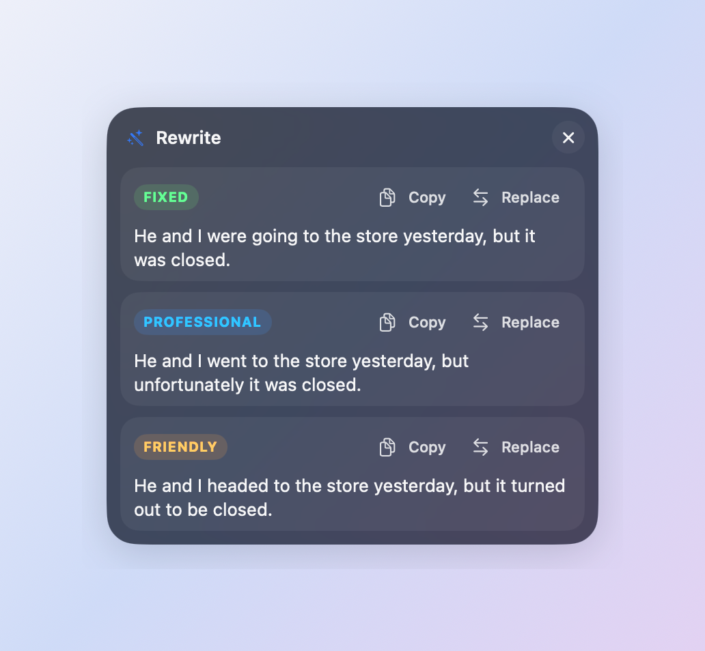
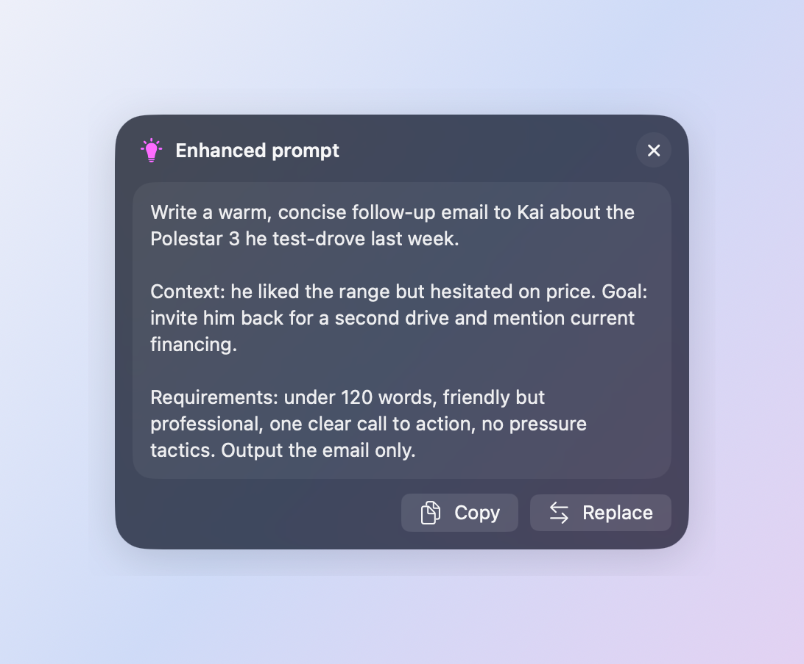

# Mousi

**Highlight text anywhere on your Mac → a tiny Liquid Glass pill appears at your cursor → copy it, fix it, or turn it into a great AI prompt.**

Mousi is a native macOS menu bar app written in Swift (AppKit + SwiftUI). It removes the little frictions of working with text and AI all day: no ⌘C, no right‑click, no switching to a chat window just to fix a sentence.

<p align="center">
  
</p>

## What it does

| Action | What happens |
|---|---|
| **Copy** | Copies the highlighted text. One click, from any app. |
| **✦ Rewrite** | Sends the text to Claude and shows three tight options — **Fixed** (grammar only, your voice kept), **Professional**, and **Friendly**. Click one to copy it, or hit **Replace** to swap it into the original app in place. |
| **💡 Prompt** | Reads the intent of what you wrote and rewrites it as a sharper, more effective AI prompt — explicit goal, the context you gave, what a good result looks like — without bloating it or asking you questions. Built on current Anthropic/OpenAI prompting guidance and the most‑upvoted community rules. |

<p align="center">
  
  &nbsp;
  
</p>

The pill fades away when you click elsewhere, type, scroll, or switch apps. Everything is designed to stay small and out of the way.

## Highlights

- **Native Liquid Glass UI** — built on macOS 26's `glassEffect`, follows Apple's guidance (one glass surface per element, plain high‑contrast content inside, adaptive light/dark).
- **Works in every app** — global mouse tracking + the Accessibility API to read the selection; a clipboard‑borrowing fallback for apps that don't expose it (clipboard is restored afterwards).
- **Bring your own Claude** — uses your **Claude subscription** through the Claude Code CLI (no API key needed), or an **Anthropic API key** if you prefer. Defaults to Haiku for speed and cost; Sonnet/Opus selectable.
- **Structured, fast** — one call returns all three rewrites as schema‑validated JSON; typical round trip is 2–5 s.
- **Zero build tooling** — no Xcode project. `swiftc` + a shell script produce a signed `.app` with a generated icon.
- **Menu bar only** — on/off toggle, launch at login, settings; no Dock icon.

## Getting started

Requires **macOS 26 Tahoe** and the Xcode Command Line Tools.

```sh
git clone https://github.com/JuniorSua/mousi.git && cd mousi
./Tools/make-signing-identity.sh   # once: creates a local self-signed signing identity
./build.sh --install               # builds, installs to /Applications, launches
```

Then:
1. Grant **Accessibility** access when macOS asks (System Settings → Privacy & Security → Accessibility → Mousi). This is what lets Mousi see what you highlighted.
2. Open **Mousi → Settings…** and press **Test**. If you have [Claude Code](https://claude.com/claude-code) installed and signed in, it just works on your subscription. Otherwise switch to "Anthropic API key" and paste one.
3. Highlight some text.

> Why the signing step? macOS ties the Accessibility grant to the app's code identity. Ad‑hoc signatures change on every build, which silently revokes it; a stable local certificate keeps the grant across rebuilds.

## How it's built

```
Sources/
  main.swift             app delegate, menu bar item, settings window
  SelectionMonitor.swift global mouse tracking, Accessibility text capture, clipboard helpers
  PillController.swift   the floating non‑activating panel: positioning, sizing, phases, actions
  PillViews.swift        SwiftUI Liquid Glass views (pill, results card, prompt card)
  ClaudeClient.swift     task definitions (rewrite / enhance prompt) + API‑key backend
  ClaudeCLI.swift        subscription backend: runs `claude -p --json-schema …` as a subprocess
  PromptEnhancer.swift   the prompt‑engineering system prompt
  Settings.swift / SettingsView.swift
Tools/
  MakeIcon.swift             draws the app icon with CoreGraphics
  make-signing-identity.sh   local code‑signing identity
build.sh                     compile → bundle → icon → sign → (install)
```

A few of the interesting problems solved along the way:

- **A panel that never steals focus.** The pill is a borderless `NSPanel` with `.nonactivatingPanel`, so your cursor and selection stay exactly where they were — which is what makes one‑click *Replace* possible (it pastes into the still‑focused app).
- **Detecting "you just selected something."** A global monitor watches mouse down/up; a drag longer than a few points or a double/triple‑click triggers a short delayed read of the focused element's `AXSelectedText`.
- **Not confusing itself.** The synthetic ⌘C/⌘V events Mousi sends are tagged so its own key monitors ignore them.
- **Cheap and fast AI.** Rewrites run on Haiku with thinking capped, via the CLI the user is already logged into — no keys to manage, roughly a fraction of a cent per use.

## Privacy

Mousi only reads text when you actively highlight it and only sends it to Claude when you click **Rewrite** or **Prompt**. Nothing is logged or stored by the app. Your API key (if you use one) lives in the app's local preferences on your Mac.

## License

MIT — see [LICENSE](LICENSE).
